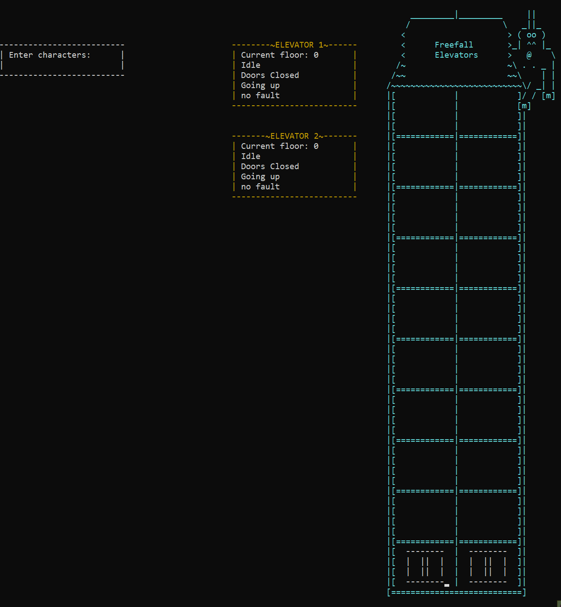

### ELEVATOR SIMULATION PROJECT
Using multithreading and RTOS concepts of pipelines, mailboxes and mutexes created a complex simulation of a building's Elevator System.
Elevators can be manually controlled and stopped individually as well as be marked for service. Auto mode creates dynamic objects as passengers that can run the simulation by making random calls to floors and set destinations.

Project done in pair-programming setting using Visual Studio LiveShare

